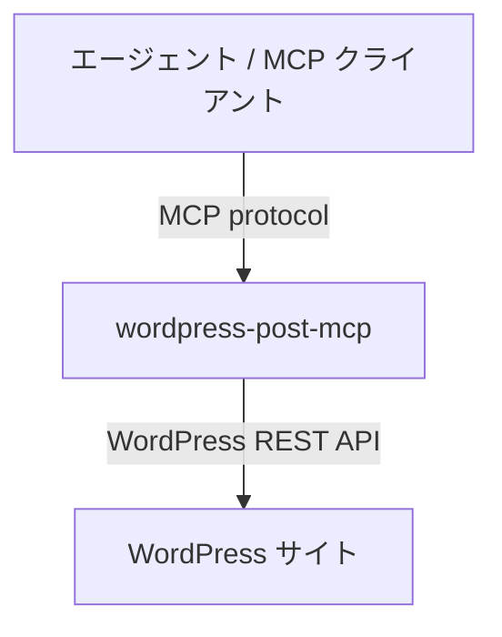

# wordpress-post-mcp

WordPress に記事を投稿・管理するための MCP サーバーです。

## これは何か

これは、WordPressサイトに対して、エージェントが記事の下書きを追加できるするための部品です。
エージェントにWordPressのライター権限を付与するイメージであり、公開権限は付与しません。

## これは何ではないか

- 汎用のWordPress管理ツールではありません。下書き記事を作成するための機能に絞っています。
- 記事の文章を生成するものではありません。それはエージェント側の仕事です。
- 記事を公開するものではありません。公開自体は人間が記事を確認した上でWordPress管理画面から行います。
- カテゴリ・タグを設計するものではありません。分類体系は人間が設計し、 WordPressに設定しておくことを期待します。

## 想定する使い方

記事素材へのアクセス手段を持つエージェントに、このMCPサーバーを接続すると下書きをWordPressに設置できる状況を期待します。
エージェントは素材と過去記事を踏まえて下書きを作り、人間がレビューしてから公開する。
記事素材へのアクセス方法は MCP サーバー、ローカルファイルなど、様々ありえます。

## 提供する機能

各ツールの引数・返り値の詳細は [docs/design.md](docs/design.md) を参照してください。

### 下書きを作る

下書き記事を作成するための基本的な機能です。
なお、事故防止のため、既存記事の更新・削除はできません。

- 下書き保存

### 参考に既存記事を読む

新しい記事を読むために既存記事を参照します。

- 記事一覧の取得（キーワード・カテゴリ・タグ・ステータスで絞り込み、全文検索を含む）
- 記事の詳細取得（本文・カテゴリ・タグ・メタ情報）

### カテゴリ・タグを設定する

適切なカテゴリ・タグを設定させます。

- カテゴリ一覧の取得
- タグ一覧の取得
- カテゴリ・タグの指定

## 構成



## セットアップ

### 必要なもの

- WordPress サイト（REST API が有効）
- WordPress のアプリケーションパスワード（投稿者権限程度を推奨）

### 設定例

```json
{
  "mcpServers": {
    "wordpress": {
      "command": "npx",
      "args": ["wordpress-post-mcp"],
      "env": {
        "WP_URL": "https://your-site.com",
        "WP_USERNAME": "your-username",
        "WP_APP_PASSWORD": "xxxx xxxx xxxx xxxx"
      }
    }
  }
}
```

## 開発

### コード品質ツール

| ツール | 用途 | 実行コマンド |
|--------|------|-------------|
| [ruff](https://docs.astral.sh/ruff/) | Linter / Formatter | `uv run ruff check src/` `uv run ruff format src/` |
| [mypy](https://mypy.readthedocs.io/) | 静的型チェック | `uv run mypy src/` |
| [vulture](https://github.com/jendrikseipp/vulture) | デッドコード検出 | `uv run vulture` |

### テスト

```bash
uv run pytest
```

## ステータス

現在、開発中です。
自分用に作っているため、仕様は予告なく変わります。
